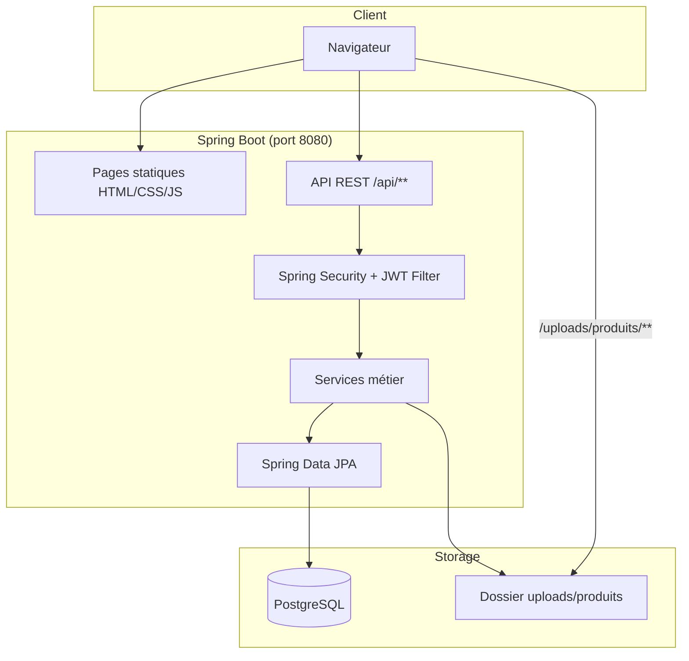

# Assigame

**Assigame** est une marketplace locale permettant à des vendeurs de publier des annonces produits et à des visiteurs de consulter un catalogue public. La plateforme inclut un espace vendeur, un back-office administrateur et un flux de modération des inscriptions et des produits.

---

## Table des matières

- [Présentation](#présentation)
- [Fonctionnalités](#fonctionnalités)
- [Stack technique](#stack-technique)
- [Architecture](#architecture)
- [Prérequis](#prérequis)
- [Installation](#installation)
- [Configuration](#configuration)
- [Lancement](#lancement)
- [Comptes par défaut](#comptes-par-défaut)
- [Parcours utilisateur](#parcours-utilisateur)
- [Structure du projet](#structure-du-projet)
- [API REST](#api-rest)
- [Règles métier](#règles-métier)
- [Frontend](#frontend)
- [Sécurité](#sécurité)
- [Tests](#tests)
- [Déploiement](#déploiement)
- [Dépannage](#dépannage)
- [Licence](#licence)

---

## Présentation

Assigame est une application **monolithique Spring Boot** qui sert à la fois :

- l’**API REST** (JSON) ;
- le **frontend statique** (HTML, CSS, JavaScript) depuis `src/main/resources/static/`.

La base de données **PostgreSQL** stocke les utilisateurs, catégories et produits. L’authentification repose sur des **tokens JWT** (stateless). Les images produits sont uploadées sur le disque local et exposées via `/uploads/produits/**`.

| Rôle | Description |
|------|-------------|
| **Visiteur** | Parcourt le catalogue et les fiches produits |
| **Vendeur** | Publie, modifie et gère ses produits |
| **Administrateur** | Valide vendeurs et produits, gère le catalogue |

---

## Fonctionnalités

### Catalogue public

- Page d’accueil (`/`) redirigée vers le catalogue
- Liste des produits **actifs** uniquement
- Filtres par catégorie, prix et recherche textuelle
- Fiche produit détaillée avec galerie, prix, catégorie, vendeur
- Produits similaires (même catégorie)
- Contact vendeur par téléphone (`tel:`)

### Espace vendeur

- Inscription avec choix d’offre (Particulier, Professionnel, Partenaire Vip)
- Connexion dédiée (`/connexion-vendeur.html`)
- Dashboard avec statistiques et activités récentes
- Liste des produits du vendeur (tous statuts)
- Publication d’un produit (4 à 6 photos obligatoires)
- Édition complète d’un produit (nom, description, prix, catégorie, photos)
- Suppression d’un produit
- Avatar avec initiales si pas de photo de profil
- Quotas de produits actifs selon l’offre vendeur

### Espace administrateur

- Connexion admin (`/admin/connexion.html`)
- Tableau de bord et vue d’ensemble
- Validation / refus des **demandes vendeur**
- Gestion du catalogue vendeurs
- Modération des **demandes produit** (EN_ATTENTE → ACTIF / REFUSE)
- Gestion des catégories
- Gestion des types vendeur

---

## Stack technique

| Couche | Technologie |
|--------|-------------|
| Backend | Java 17, Spring Boot 4.0.6 |
| API | Spring Web MVC (REST) |
| Sécurité | Spring Security + JWT (jjwt 0.12.5) |
| Persistance | Spring Data JPA, Hibernate |
| Base de données | PostgreSQL |
| Frontend | HTML5, CSS3, JavaScript vanilla |
| Build | Maven |
| Utilitaires | Lombok, BCrypt |

---

## Architecture



### Modèle de données (entités principales)

| Entité | Rôle |
|--------|------|
| `TypeUtilisateur` | Rôle / offre (ADMIN, Particulier, Professionnel, Partenaire Vip) |
| `Utilisateur` | Compte vendeur ou admin |
| `CategorieProduit` | Catégorie du catalogue |
| `Produit` | Annonce liée à un vendeur et une catégorie |

### Statuts

**Compte utilisateur** : `ACTIF`, `EN_ATTENTE`, `REFUSE`, `SUSPENDU`

**Produit** : `ACTIF`, `EN_ATTENTE`, `REFUSE`, `SUSPENDU`

---

## Prérequis

- **Java 17** ou supérieur
- **Maven 3.8+**
- **PostgreSQL 14+** (ou compatible)
- Un navigateur moderne (Chrome, Firefox, Edge)

---

## Installation

### 1. Cloner le dépôt

```bash
git clone <url-du-depot>
cd assigame
```

### 2. Créer la base PostgreSQL

```sql
CREATE DATABASE basespring;
```

Adaptez le nom de la base si nécessaire dans la configuration.

### 3. Configurer l’application

Copiez et adaptez `src/main/resources/application.properties` (voir section [Configuration](#configuration)).

> **Recommandation** : ne commitez pas vos mots de passe. Utilisez un fichier local `application-local.properties` (ignoré par git) ou des variables d’environnement Spring.

### 4. Compiler le projet

```bash
mvn clean compile
```

---

## Configuration

Fichier principal : `src/main/resources/application.properties`

| Propriété | Description | Exemple |
|-----------|-------------|---------|
| `spring.datasource.url` | URL JDBC PostgreSQL | `jdbc:postgresql://localhost:5433/basespring` |
| `spring.datasource.username` | Utilisateur BDD | `postgres` |
| `spring.datasource.password` | Mot de passe BDD | `votre_mot_de_passe` |
| `spring.jpa.hibernate.ddl-auto` | Schéma Hibernate | `update` |
| `jwt.secret` | Clé secrète JWT (longue, aléatoire) | `votre-cle-secrete-tres-longue` |
| `jwt.expiration` | Durée du token (ms) | `86400000` (24 h) |
| `app.upload.dir` | Dossier des images produits | `uploads/produits` |
| `spring.servlet.multipart.max-file-size` | Taille max par fichier | `5MB` |
| `spring.servlet.multipart.max-request-size` | Taille max requête upload | `40MB` |

Le dossier `uploads/` est ignoré par git (fichiers locaux non versionnés).

---

## Lancement

### Mode développement

```bash
mvn spring-boot:run
```

L’application est accessible sur : **http://localhost:8080**

### Build JAR exécutable

```bash
mvn clean package -DskipTests
java -jar target/assigame-0.0.1-SNAPSHOT.jar
```

### Pages principales

| URL | Description |
|-----|-------------|
| `/` | Catalogue public |
| `/catalogue.html` | Catalogue |
| `/fiche-produit.html?id={id}` | Fiche produit |
| `/devenir-vendeur.html` | Inscription vendeur |
| `/choix-offre-vendeur.html` | Choix de l’offre |
| `/connexion-vendeur.html` | Connexion vendeur |
| `/vendeur/dashboard.html` | Dashboard vendeur |
| `/vendeur/produits.html` | Liste des produits vendeur |
| `/vendeur/produits-ajout.html` | Publier un produit |
| `/vendeur/detail-produit-vendeur.html?id={id}` | Modifier un produit |
| `/admin/connexion.html` | Connexion admin |
| `/admin/administration.html` | Dashboard admin |

---

## Comptes par défaut

Au premier démarrage, `DataInitializer` crée automatiquement :

### Types d’utilisateur

- `ADMIN` — Administrateur
- `Particulier` — Jusqu’à 5 produits actifs
- `Professionnel` — Jusqu’à 15 produits actifs
- `Partenaire Vip` — Quota illimité

### Compte administrateur

| Champ | Valeur |
|-------|--------|
| Email | `admin@assigame.com` |
| Mot de passe | `Admin1234` |

> Changez ce mot de passe en production.

Les vendeurs s’inscrivent via le formulaire public ; leur compte reste en `EN_ATTENTE` jusqu’à validation par un admin.

---

## Parcours utilisateur

### Devenir vendeur

1. Choisir une offre sur `/choix-offre-vendeur.html`
2. Remplir le formulaire `/devenir-vendeur.html`
3. Attendre la validation admin (`EN_ATTENTE` → `ACTIF`)
4. Se connecter sur `/connexion-vendeur.html`

### Publier un produit

1. Aller sur `/vendeur/produits-ajout.html`
2. Renseigner nom, description, prix, catégorie
3. Ajouter **4 à 6 photos**
4. Publier → statut `EN_ATTENTE`
5. L’admin approuve → statut `ACTIF` (visible sur le catalogue)

### Modifier un produit

1. `/vendeur/produits.html` → icône œil
2. Page `/vendeur/detail-produit-vendeur.html?id={id}`
3. Modifier les champs et cliquer **Enregistrer**
4. Le produit repasse en `EN_ATTENTE` (sauf action admin)

---

## Structure du projet

```
assigame/
├── pom.xml
├── src/
│   ├── main/
│   │   ├── java/com/esgis2026/assigame/
│   │   │   ├── AssigameApplication.java
│   │   │   ├── config/          # Security, Web, migrations, seed
│   │   │   ├── controller/      # REST controllers
│   │   │   ├── dto/             # DTO auth & admin
│   │   │   ├── entity/          # Entités JPA
│   │   │   ├── exception/       # Gestion globale des erreurs
│   │   │   ├── repository/      # Repositories Spring Data
│   │   │   ├── security/        # JWT, UserDetails, filtres
│   │   │   └── service/         # Logique métier
│   │   └── resources/
│   │       ├── application.properties
│   │       └── static/          # Frontend
│   │           ├── catalogue.html
│   │           ├── fiche-produit.html
│   │           ├── connexion-vendeur.html
│   │           ├── devenir-vendeur.html
│   │           ├── admin/         # Pages admin
│   │           ├── vendeur/       # Pages vendeur
│   │           ├── css/
│   │           ├── js/
│   │           └── images/
│   └── test/
└── uploads/                     # Images produits (généré localement)
```

---

## API REST

Base URL : `http://localhost:8080`

### Authentification (`/api/auth`)

| Méthode | Endpoint | Accès | Description |
|---------|----------|-------|-------------|
| `POST` | `/register` | Public | Inscription vendeur |
| `GET` | `/types-vendeur` | Public | Types vendeur disponibles |
| `POST` | `/login` | Public | Connexion → token JWT |
| `POST` | `/logout` | Public | Déconnexion (côté client) |
| `GET` | `/me` | Authentifié | Profil connecté |

**Exemple de connexion :**

```bash
curl -X POST http://localhost:8080/api/auth/login \
  -H "Content-Type: application/json" \
  -d '{"email":"admin@assigame.com","motDePasse":"Admin1234"}'
```

**En-tête pour les routes protégées :**

```
Authorization: Bearer <token_jwt>
```

### Produits (`/api/produits`)

| Méthode | Endpoint | Accès | Description |
|---------|----------|-------|-------------|
| `GET` | `/list` | Public | Produits actifs (catalogue) |
| `GET` | `/mes-produits` | Vendeur | Produits du vendeur connecté |
| `GET` | `/search/{id}` | Public | Détail produit actif |
| `GET` | `/search/{id}/similaires` | Public | Produits similaires |
| `POST` | `/upload` | Vendeur / Admin | Upload images (multipart) |
| `POST` | `/create` | Vendeur / Admin | Créer un produit |
| `PUT` | `/update/{id}` | Vendeur / Admin | Modifier un produit |
| `DELETE` | `/delete/{id}` | Vendeur / Admin | Supprimer un produit |

### Catégories (`/api/categorieproduit`)

| Méthode | Endpoint | Accès | Description |
|---------|----------|-------|-------------|
| `GET` | `/list` | Public | Liste des catégories |
| `POST` | `/create` | Admin | Créer une catégorie |
| `PUT` | `/update/{nom}` | Admin | Modifier une catégorie |
| `DELETE` | `/delete/{nom}` | Admin | Supprimer une catégorie |

### Admin — vendeurs (`/api/admin/demandes-vendeur`)

| Méthode | Endpoint | Description |
|---------|----------|-------------|
| `GET` | `/list` | Demandes en attente |
| `GET` | `/catalogue` | Tous les vendeurs |
| `POST` | `/approve/{id}` | Approuver un vendeur |
| `POST` | `/refuse/{id}` | Refuser un vendeur |

### Admin — produits (`/api/admin/demandes-produits`)

| Méthode | Endpoint | Description |
|---------|----------|-------------|
| `GET` | `/list` | Produits en attente |
| `GET` | `/search/{id}` | Détail pour modération |
| `POST` | `/approve/{id}` | Approuver un produit |
| `POST` | `/refuse/{id}` | Refuser un produit |

### Admin — catalogue complet

| Méthode | Endpoint | Description |
|---------|----------|-------------|
| `GET` | `/api/admin/produits/list` | Tous les produits |

---

## Règles métier

### Produits

- **4 à 6 images** obligatoires par produit (chemins CSV dans le champ `image`)
- Description limitée à **2000 caractères**
- Un vendeur ne peut pas avoir deux produits **actifs** avec le même nom
- Toute modification par un vendeur remet le produit en **`EN_ATTENTE`**
- Seuls les produits **`ACTIF`** apparaissent sur le catalogue public

### Quotas vendeur (produits actifs)

| Offre | Limite |
|-------|--------|
| Particulier | 5 |
| Professionnel | 15 |
| Partenaire Vip | Illimité |

### Images

- Formats acceptés : PNG, JPEG, GIF, SVG
- Taille max : **5 Mo** par fichier
- Stockage local : `uploads/produits/`
- URL publique : `/uploads/produits/<fichier>`

---

## Frontend

Le frontend est **100 % statique**, sans framework JS.

| Fichier | Rôle |
|---------|------|
| `js/api.js` | Client HTTP, gestion JWT (sessions admin/vendeur séparées) |
| `js/utils.js` | Utilitaires (prix FCFA, toasts, placeholders) |
| `js/catalogue.js` | Catalogue et filtres |
| `js/fiche-produit.js` | Fiche produit publique |
| `js/vendeur/*.js` | Espace vendeur |
| `js/admin/*.js` | Espace admin |

### Sessions localStorage

| Clé | Usage |
|-----|-------|
| `assigame_vendor_token` / `assigame_vendor_user` | Session vendeur |
| `assigame_admin_token` / `assigame_admin_user` | Session admin |

Les pages sous `/admin/` et `/vendeur/` utilisent des sessions distinctes pour éviter les conflits de connexion.

---

## Sécurité

- Mots de passe hashés avec **BCrypt**
- API stateless via **JWT**
- Rôles Spring Security : `ROLE_ADMIN`, `ROLE_Particulier`, etc.
- Un vendeur ne peut modifier/supprimer **que ses propres produits**
- Les tokens expirés ou invalides n’empêchent pas l’accès aux endpoints publics
- Les pages HTML sont servies librement ; la protection est sur les **endpoints API**

### Bonnes pratiques production

- Changer `jwt.secret` et les mots de passe par défaut
- Ne pas exposer `application.properties` avec des secrets en git
- Utiliser HTTPS
- Sauvegarder PostgreSQL et le dossier `uploads/`
- Configurer CORS si le front est hébergé séparément

---

## Tests

```bash
mvn test
```

Les tests d’intégration de base se trouvent dans `src/test/java/com/esgis2026/assigame/`.

---

## Déploiement

Assigame est une application **Spring Boot + PostgreSQL** avec stockage fichier local. Elle n’est pas conçue pour un hébergement statique type Vercel seul.

### Options recommandées

| Plateforme | Adapté pour |
|------------|-------------|
| [Railway](https://railway.app) | Spring Boot + PostgreSQL |
| [Render](https://render.com) | Web service + base managée |
| [Fly.io](https://fly.io) | Conteneur + volume pour uploads |
| VPS (OVH, DigitalOcean…) | Contrôle total |

### Points d’attention

1. **PostgreSQL** : fournir `spring.datasource.url` en variable d’environnement
2. **JWT** : définir `jwt.secret` en production
3. **Uploads** : utiliser un volume persistant ou migrer vers un stockage objet (S3, Cloudinary…)
4. **Port** : Spring Boot écoute sur `8080` par défaut (`server.port` configurable)

Exemple de variables d’environnement :

```bash
SPRING_DATASOURCE_URL=jdbc:postgresql://host:5432/assigame
SPRING_DATASOURCE_USERNAME=postgres
SPRING_DATASOURCE_PASSWORD=secret
JWT_SECRET=cle-production-tres-longue-et-aleatoire
APP_UPLOAD_DIR=/data/uploads/produits
```

---

## Dépannage

| Problème | Solution |
|----------|----------|
| Erreur connexion PostgreSQL | Vérifier URL, port, identifiants et que PostgreSQL tourne |
| Catalogue vide | Vérifier qu’il existe des produits avec statut `ACTIF` |
| 401 sur API vendeur | Se reconnecter ; vider `localStorage` si token expiré |
| Images cassées | Vérifier que le dossier `uploads/produits` existe et est accessible |
| Produit non modifiable | Vérifier que le produit appartient au vendeur connecté |
| Quota atteint | Passer à une offre supérieure ou désactiver des produits actifs |

### Vider la session navigateur

```javascript
localStorage.removeItem('assigame_vendor_token');
localStorage.removeItem('assigame_vendor_user');
localStorage.removeItem('assigame_admin_token');
localStorage.removeItem('assigame_admin_user');
```

---

## Licence

Projet académique / personnel — **ESGIS 2026**.

Pour toute question ou contribution, ouvrez une issue ou contactez l’équipe du projet.

---

**Assigame** — Marketplace locale avec modération vendeurs et produits.
